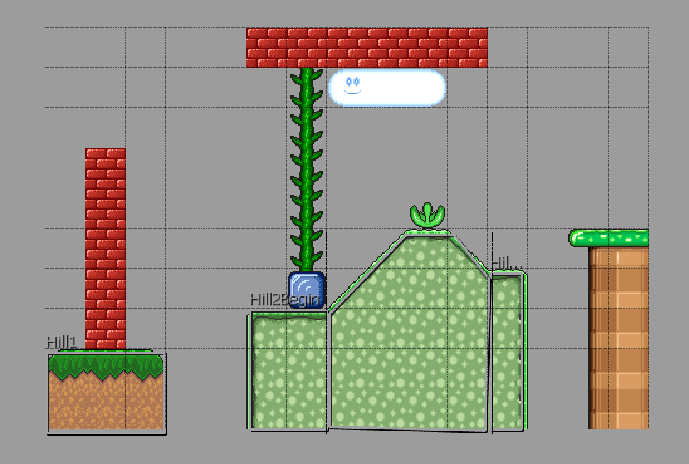

NOTE: This tutorial is copied from [the original at OutlawGameTools.com](http://lime.outlawgametools.com/tutorials/08-complex-physics-objects/)

## 08 – Complex Physics Objects
Difficulty: Beginner

Duration: 20 minutes

Description:

In a previous tutorial we saw how easy it was to create simple physics objects from tiles and objects, we will now see how easy it is to create more interesting shapes.

### Step 1: Getting your map

For this tutorial we are going to use the map we created in the previous tutorial, make sure to remove any physics objects you created for the interesting bit of terrain in the centre as that is what we are going to build today.

### Step 2: Creating a circular object

Creating a circular body couldn’t be simpler and can be done on both tiles and objects, this example will show you how to create one on a tile however it is the same process for an object.

First set up your tile properties as before, remembering to include the “HasBody” property. Then simply add a “radius” property as shown below.

You can of course still set all the other physics properties as before I am just showing this now to keep it nice and simple.

You may also wish to set the DrawMode to “hybrid” just so that you can see your new circular body.

### Step 3: Creating a polygon object

Circles are great for some things but what is really great is custom shapes, these can help make terrain creation so much simpler. Rather than using trial and error with rotation you can just draw out your terrain like a dot-to-dot picture.

In order to do this you will use the polygon tool. Click at the corners of your polygon. The resulting shape must also be convex-only, so you'll need to break up any concave shapes into several convex ones.

I have also set the bodyType to static in the Object Properties to make sure it stays where we want it and have added some more tiles above it to see them fall and slide on our terrain.

### Step 4: Run your game

If you run your game now you will see all your tiles fall onto your new terrain.

### Step 5: Even more complex shapes

In a soon to be created tutorial you will see how easy it is to create bodies built up of multiple shapes.

Resources:

Completed Project: `git clone https://github.com/anthonymoralez/lime-tutorials`
