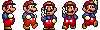

NOTE: This tutorial is copied from [the original at OutlawGameTools.com](http://lime.outlawgametools.com/tutorials/11-animated-characters/)

## 11 – Animated Characters
Difficulty: Beginner

Duration: 30 minutes

Description:

This tutorial is an extension to the previous tutorial so if you haven’t done that one yet please do so now. In this tutorial we will see how easy it is to give our player some basic animations. This is not the only way this can be achieved, this is just the way I am showing here, if you have a better way please email me.

### Step 1: Getting your map

We will be using the exact same map we created in the last tutorial, so go ahead and make of a copy of that project now as we need the code as well.


You can download the map [here](tutorial-11.tmx).

### Step 2: Creating the animation assets

For the animations I have borrowed some fairly well knows ones I found on the internet, I think you’ll recognise them. However I am sad to see our little “guy.png” go, I’m sure he will come back later on.

You can download all the the animation tileset [here](player.png).

You will need to add the tileset into Lime in the normal way. The tile width is "20" and the height is "30"



### Step 3: Creating your player

The player creation will be a little different then before, rather than creating it via the use of an Object you will be doing it completely in Tiled so firstly remove your Player Object for the map.

Now add all the properties you had before – “IsPlayer” and the Physics properties that were added through code – directly to the first tile in the player tileset so that it looks like this:


Now place that tile somewhere on the map in the layer that you want the player to be in based on the Z-Depth.

You now need to go into your main.lua file and replace the Object listener function – onPlayerSpawnObject – with this property listener instead. All it does it store off a reference to your Player Sprite so that we can access it later.

```lua
local onPlayerProperty = function(property, type, object)
    player = object.sprite
end
map:addPropertyListener("IsPlayer", onPlayerProperty)
```

With that now in you should be able to run your game and get your new player image moving around, naturally there are still no animations though.

The next step is to add a new JUMPING state like so:

```lua
local STATE_JUMPING = "Jumping"
```

And then make sure you set in in the jump function like the rest of the states:

```lua
player.state = STATE_JUMPING
```

### Step 4: Creating the animation properties

The animations properties are probably the trickiest part of this, not that hard themselves just a little fiddly. For this to work we need to set up animation sequences for each of our states, IDLE, WALKING and JUMPING. In a full game you would want lots more states as well as tween-states such as JUMP_LAUNCH, JUMP_IN_AIR and JUMP_LAND but we are trying to keep things simple here.

The following image shows the animation properties that you will need on your player tile. I have temporarily removed all the other properties that we set previously just to make the screenshot clearer but please remember that you do need those.


As you can see I have the all important “IsAnimated” property as well as a “sequences” property listing (without spaces) our three animation sequences. For each sequence I have then set up a property with the various settings needed.

### Step 5: Adding the code

The actual code to bring all this to life is really simple, all I have done is added the following two lines of code to the end of each of the main HUD event handlers:

```lua
player:setSequence"anim" .. player.state)
player:play()
```

All this does is prepare the animation sequence based on the player state and then play it.

I’ve also added the following code to the first part of the if statement in the onCollision handler so that when the player hits the ground they revert back to the IDLE state.

```lua
if player.state == STATE_JUMPING then
    player.state = STATE_IDLE
    player:setSequence"anim" .. player.state)
    player:play()
end
```

And finally I added the following code right at the end of main.lua just to set the initial state:

```lua
player.state = STATE_IDLE
player:setSequence"anim" .. player.state)
player:play()
```

### Step 6: Run your game

If you run your game now your player be able to walk left and right as well as jump when you press the appropriate buttons. However he always faces the same direction, we can fix that now very easily. Simply place the following line of code in moveLeft and moveRight event handlers immediately after setting the players direction:

```lua
player.xScale = player.direction
```

This is a simple little trick to flip your sprite.


Resources:

Completed Project: `git clone https://github.com/anthonymoralez/lime-tutorials`
